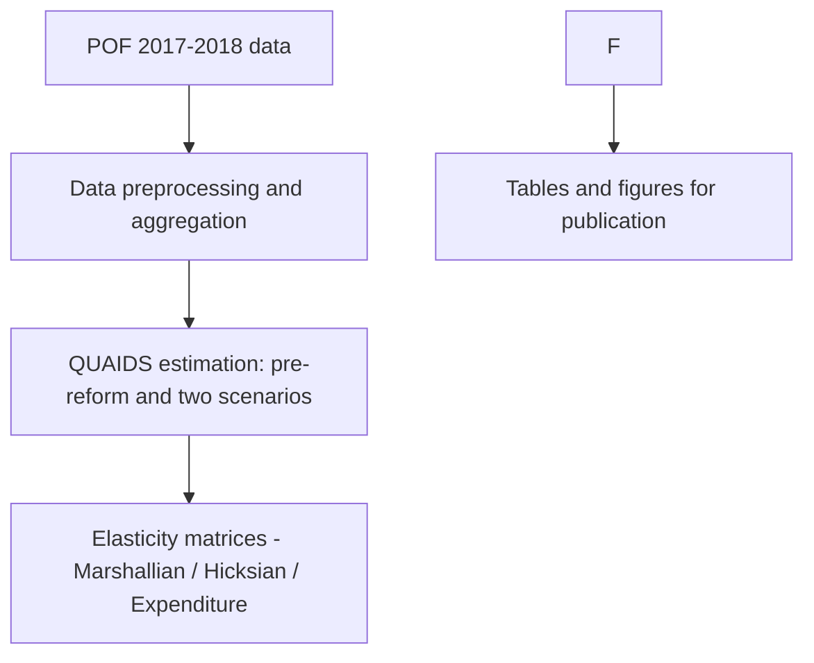

# QUAIDS Modeling of Brazilian Food Demand under Tax Reform Scenarios

> Code, data, and replication materials for an anonymized academic article submitted for international peer review.

## Abstract (blinded)
This repository provides the full analytical pipeline for modeling the Brazilian food demand system before and after a tax reform. The analysis combines a Quadratic Almost Ideal Demand System (QUAIDS) to estimate price and income elasticities by food groups.  
All data are based on the *Household Budget Survey (POF 2017–2018)* and anonymized sociodemographic variables.

---

## Repository Structure
```
├── Food consumption data/
│   ├── Data/               # Raw and processed data from POF and sociodemographic sources
│   └── Scripts/            # Data cleaning and preprocessing routines (Stata)
│
└── QUAIDS/
   ├── Data/               # Demand system estimation dataset (corrected for endogeneity)
   ├── Exports/            # Estimated elasticities used as inputs to DiD
   └── Scripts/
       ├── Status quo/     # Pre-reform baseline (R scripts)
       ├── Scenario 1/     # Post-reform scenario 1
       └── Scenario 2/     # Post-reform scenario 2


```

---

## Workflow Overview


### Step 1: Data Construction
- Source: POF microdata (IBGE) + demographic strata and regional identifiers.
- Outputs stored under `Food consumption data/Data/`.
- Cleaning and aggregation scripts in `Food consumption data/Scripts/`.

### Step 2: QUAIDS Estimation
- Conducted in R.
- Separate scripts for:
  - `Status quo/` — baseline estimation (pre-reform);
  - `Scenario 1/` and `Scenario 2/` — two distinct post-reform tax designs.
- Estimated parameters and covariance matrices exported to `.xlsx`.

---

## Requirements

### R Environment
- R ≥ 4.3  
- Required packages (approximate):  
  `micEconAids`, `systemfit`, `car`, `sandwich`, `dplyr`, `purrr`, `readxl`, `openxlsx`, `ggplot2`

---

## Quick Start

```bash
# Clone repository
git clone https://github.com/<anonymous>/reproduction.git
cd reproduction

# Run QUAIDS estimation (R)
cd QUAIDS/Scripts/Status\ quo
Rscript pre_reform_1.R
```

---

## Outputs
| Folder | Description |
|---------|--------------|
| `QUAIDS/Exports/` | Elasticity matrices (Marshallian, Hicksian, Expenditure) |
| `Food consumption data/Data/` | Aggregated data for model input |
| `*.xlsx`, `*.csv` | Machine-readable replication outputs |

---

## Reproducibility & Ethics
- No confidential microdata are distributed; POF microdata must be obtained directly from IBGE.
- All files in this repository are synthetic or processed aggregates.
- Environment variables are defined in `.env.example` (no credentials included).

---

## Citation (blinded)
> To be completed after peer review acceptance.

## License
MIT License.
